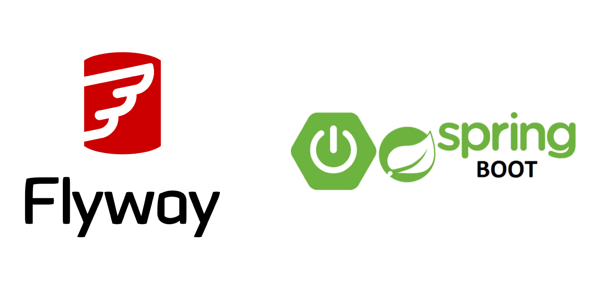

<div id="top" align="center">
  <h1> Demo Spring Boot with Flyway and H2 </h1>
</div>

<br />
<div align="center">
  <a>
    
  </a>
  <div align="start">
    In this repository I am sharing some of what I have been learning about Spring Boot with Flyway. By following the instructions and reading the code I hope I can contribute to your development. Enjoy your studies. :coffee: 
  </div>
  <h3 align="start">
    Go to <a href="https://start.spring.io/">Spring Initializr</a>, configure and add the dependencies.
  </h3>
  <div align="start">
    1. Spring Web </br>
    2. Spring Data JPA </br>
    3. H2 Database </br>
  </div>
 
  <h3 align="start">Community Plugins and Integrations:</h3>

  <p align="start">
    Spring Boot comes with out-of-the-box integration <a href="https://docs.spring.io/spring-boot/docs/current/reference/html/howto.html#howto.data-initialization.migration-tool.flyway">for Flyway. </a>
    </br>
  </p>
</div>

```
<dependency>
    <groupId>org.flywaydb</groupId>
    <artifactId>flyway-core</artifactId>
    <version>8.5.13</version>
</dependency>
```
Or build.gradle:

```
compile "org.flywaydb:flyway-core:8.5.13"
```
### Sample configuration 

```
spring:
  flyway:
    url: jdbc:h2:mem:hbasedb
    user: user
    password: zxcvbYe
    schemas:
      - flywayschema
    locations:
      - classpath:db/migration
```
##### or
```

<properties>
  ...
  <flyway.user>user</flyway.user>
  <flyway.password>zxcvbYe</flyway.password>
  <flyway.url>jdbc:h2:mem:hbasedb</flyway.url>
  ...
</properties>
  ...
<build>
  <plugins>
        <plugin>
          <groupId>org.flywaydb</groupId>
          <artifactId>flyway-maven-plugin</artifactId>
          <version>8.0.0</version>
          <configuration>
            <user>${flyway.user}</user>
            <password>${flyway.password}</password>
            <url>${flyway.url}</url>
          </configuration>
        </plugin>
        ...
   </plugins>
<build>      
          
```

### Flyway Naming Patterns

The default naming patterns within Flyway are documented clearly. You have a prefix that determines the type of file, whether a versioned migration (V), an undo migration (U), or a repeatable migration (R). </br>


Example of used files</br>


```sql
-- V1_0__create_tables.sql
CREATE TABLE IF NOT EXISTS tb_user (
    id int NOT NULL AUTO_INCREMENT PRIMARY KEY,
    name varchar(40),
    email varchar(50)
);
CREATE TABLE IF NOT EXISTS tb_login (
    id int NOT NULL AUTO_INCREMENT PRIMARY KEY,
    login varchar(40),
    pass varchar(50),
    id_user int NOT NULL
);
ALTER TABLE tb_login
ADD CONSTRAINT user_id_fk
FOREIGN KEY (id_user) REFERENCES tb_user;
```
##### Thanks :call_me_hand:
 [![LinkedIn][linkedin-shield]][linkedin-url]


<!-- MARKDOWN LINKS & IMAGES -->
<!-- https://www.markdownguide.org/basic-syntax/#reference-style-links -->
[instagram-shield]: https://img.shields.io/badge/Instagram-E4405F?style=for-the-badge&logo=instagram&logoColor=white
[instagram-url]: https://www.instagram.com/kaliston_s/
[linkedin-shield]: https://img.shields.io/badge/-LinkedIn-black.svg?style=for-the-badge&logo=linkedin&colorB=555
[linkedin-url]: https://www.linkedin.com/in/kalistonss/

